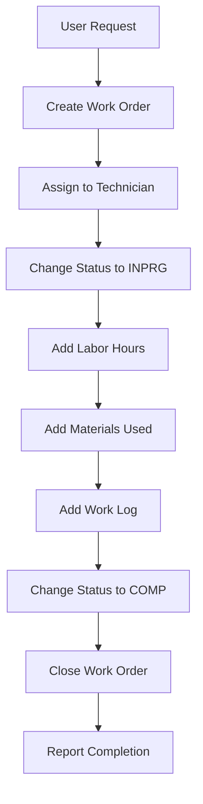

# AI Agents Guide for Maximo MAS 9.x MCP Server

## Overview

This document provides comprehensive guidance for AI agents (like Claude, ChatGPT, and other LLMs) on how to effectively interact with the IBM Maximo MAS 9.x MCP Server. It covers agent capabilities, interaction patterns, best practices, and example workflows.

## Table of Contents

1. [Agent Capabilities](#agent-capabilities)
2. [MCP Protocol Integration](#mcp-protocol-integration)
3. [Tool Usage Patterns](#tool-usage-patterns)
4. [Agent Workflows](#agent-workflows)
5. [Best Practices](#best-practices)
6. [Error Handling](#error-handling)
7. [Example Interactions](#example-interactions)
8. [Multi-Agent Collaboration](#multi-agent-collaboration)

---

## Agent Capabilities

### What AI Agents Can Do

AI agents connected to this MCP server can:

✅ **Work Order Management**
- Create, read, update, and delete work orders
- Change work order status through workflows
- Add labor, materials, and services
- Manage work logs and assignments
- Search and filter work orders

✅ **Asset Management**
- Manage asset lifecycle
- Record meter readings
- Move assets between locations
- Update asset specifications
- Navigate asset hierarchies

✅ **Inventory Operations**
- Issue and return inventory items
- Transfer between storerooms
- Adjust inventory balances
- Track transaction history
- Manage item masters

✅ **Service Requests**
- Create and manage service requests
- Convert SRs to work orders
- Track SR status and workflow

✅ **Purchase Orders**
- Create and manage purchase orders
- Receive PO items
- Process approvals

✅ **Advanced Operations**
- Execute complex OSLC queries
- Perform bulk operations
- Explore API schemas
- Validate data before submission
- Build interactive queries

### Agent Limitations

❌ **What Agents Cannot Do**
- Direct database access
- Bypass Maximo security
- Modify system configuration
- Access data outside permissions
- Execute arbitrary code on server

---

## MCP Protocol Integration

### Connection Setup

Agents connect to the MCP server using the Model Context Protocol:

```typescript
// Agent connection configuration
{
  "mcpServers": {
    "maximo": {
      "command": "node",
      "args": ["/path/to/maximo-mcp-server/dist/index.js"],
      "env": {
        "MAXIMO_HOST": "https://your-maximo-host.com",
        "MAXIMO_API_KEY": "your-api-key"
      }
    }
  }
}
```

### Tool Discovery

Upon connection, agents can discover available tools:

```json
{
  "method": "tools/list",
  "params": {}
}
```

**Response includes 80+ tools organized by category:**
- Work Order tools (11)
- Asset tools (9)
- Inventory tools (8)
- Service Request tools (7)
- Purchase Order tools (7)
- Location tools (6)
- Person/Labor tools (6)
- PM tools (7)
- Classification tools (4)
- Attachment tools (4)
- Query tools (4)
- Bulk operation tools (4)
- Development tools (6)

### Tool Invocation

Agents invoke tools using standard MCP protocol:

```json
{
  "method": "tools/call",
  "params": {
    "name": "maximo_create_workorder",
    "arguments": {
      "description": "Repair centrifugal pump",
      "assetnum": "PUMP001",
      "location": "PLANT-100",
      "worktype": "CM",
      "priority": 2,
      "siteid": "BEDFORD"
    }
  }
}
```

---

## Tool Usage Patterns

### Pattern 1: Single Operation

**Use Case:** Simple, one-time operations

```
User: "Create a work order to repair pump PUMP001"

Agent Process:
1. Identify required tool: maximo_create_workorder
2. Extract parameters from user request
3. Invoke tool with parameters
4. Return formatted result to user
```

**Example:**
```json
{
  "tool": "maximo_create_workorder",
  "arguments": {
    "description": "Repair pump PUMP001",
    "assetnum": "PUMP001",
    "siteid": "BEDFORD",
    "priority": 2
  }
}
```

### Pattern 2: Sequential Operations

**Use Case:** Multi-step workflows

```
User: "Create a work order for pump repair and assign it to John"

Agent Process:
1. Create work order (maximo_create_workorder)
2. Wait for work order number
3. Assign to person (maximo_assign_workorder)
4. Confirm completion
```

**Example Sequence:**
```json
// Step 1: Create work order
{
  "tool": "maximo_create_workorder",
  "arguments": {
    "description": "Repair pump",
    "assetnum": "PUMP001",
    "siteid": "BEDFORD"
  }
}

// Step 2: Assign work order (using wonum from step 1)
{
  "tool": "maximo_assign_workorder",
  "arguments": {
    "wonum": "1001",
    "laborcode": "JOHN"
  }
}
```

### Pattern 3: Query and Process

**Use Case:** Search, analyze, and act on results

```
User: "Find all high-priority work orders and change them to critical"

Agent Process:
1. Query work orders (maximo_search_workorders)
2. Analyze results
3. For each work order:
   - Update priority (maximo_update_workorder)
4. Summarize changes
```

**Example:**
```json
// Step 1: Search
{
  "tool": "maximo_search_workorders",
  "arguments": {
    "priority": 2,
    "status": "WAPPR",
    "pageSize": 100
  }
}

// Step 2: Update each (in loop)
{
  "tool": "maximo_update_workorder",
  "arguments": {
    "wonum": "1001",
    "updates": {
      "priority": 1
    }
  }
}
```

### Pattern 4: Bulk Operations

**Use Case:** Efficient batch processing

```
User: "Create 10 preventive maintenance work orders"

Agent Process:
1. Prepare batch data
2. Use bulk create tool
3. Handle results and errors
4. Report summary
```

**Example:**
```json
{
  "tool": "maximo_bulk_create",
  "arguments": {
    "objectStructure": "mxwodetail",
    "records": [
      {
        "description": "PM - Monthly inspection 1",
        "worktype": "PM",
        "siteid": "BEDFORD"
      },
      // ... 9 more records
    ],
    "continueOnError": true
  }
}
```

### Pattern 5: Exploratory Analysis

**Use Case:** Data exploration and insights

```
User: "Analyze work order trends for the past month"

Agent Process:
1. Query work orders with date filter
2. Analyze data (status distribution, priorities, etc.)
3. Generate insights
4. Present findings
```

**Example:**
```json
{
  "tool": "maximo_query",
  "arguments": {
    "objectStructure": "mxwodetail",
    "select": "wonum,status,priority,reportdate,worktype",
    "where": "reportdate>=\"2024-01-01T00:00:00Z\"",
    "pageSize": 1000
  }
}
```

---

## Agent Workflows

### Workflow 1: Complete Work Order Lifecycle



**Agent Implementation:**

```typescript
// Pseudo-code for agent workflow
async function completeWorkOrderLifecycle(userRequest) {
  // Step 1: Create work order
  const wo = await callTool('maximo_create_workorder', {
    description: extractDescription(userRequest),
    assetnum: extractAsset(userRequest),
    siteid: 'BEDFORD'
  });
  
  // Step 2: Assign
  await callTool('maximo_assign_workorder', {
    wonum: wo.wonum,
    laborcode: extractTechnician(userRequest)
  });
  
  // Step 3: Start work
  await callTool('maximo_change_workorder_status', {
    wonum: wo.wonum,
    status: 'INPRG'
  });
  
  // Step 4: Add labor
  await callTool('maximo_add_labor', {
    wonum: wo.wonum,
    laborcode: extractTechnician(userRequest),
    regularhrs: 4.0
  });
  
  // Step 5: Add materials
  await callTool('maximo_add_material', {
    wonum: wo.wonum,
    itemnum: 'BEARING-001',
    itemqty: 2
  });
  
  // Step 6: Add work log
  await callTool('maximo_add_worklog', {
    wonum: wo.wonum,
    description: 'Replaced bearing and tested pump'
  });
  
  // Step 7: Complete
  await callTool('maximo_change_workorder_status', {
    wonum: wo.wonum,
    status: 'COMP'
  });
  
  // Step 8: Close
  await callTool('maximo_change_workorder_status', {
    wonum: wo.wonum,
    status: 'CLOSE'
  });
  
  return `Work order ${wo.wonum} completed successfully`;
}
```

### Workflow 2: Asset Maintenance Tracking

```
User: "Track maintenance for asset PUMP001"

Agent Actions:
1. Get asset details
2. Get asset meter readings
3. Get related work orders
4. Get PM schedule
5. Analyze maintenance history
6. Provide recommendations
```

### Workflow 3: Inventory Management

```
User: "Issue parts for work order 1001"

Agent Actions:
1. Get work order details
2. Check required materials
3. Check inventory availability
4. Issue items from storeroom
5. Update work order
6. Confirm transaction
```

### Workflow 4: Reporting and Analytics

```
User: "Generate monthly maintenance report"

Agent Actions:
1. Query work orders for date range
2. Query asset data
3. Query inventory transactions
4. Analyze data
5. Generate insights
6. Format report
7. Present findings
```

---

## Best Practices

### For AI Agents

#### 1. Context Awareness

```typescript
// Good: Maintain context across interactions
const context = {
  currentWorkOrder: null,
  currentAsset: null,
  recentOperations: []
};

// Use context to make intelligent decisions
if (context.currentWorkOrder) {
  // Continue working with current work order
}
```

#### 2. Error Handling

```typescript
// Always handle errors gracefully
try {
  const result = await callTool('maximo_create_workorder', params);
  return formatSuccess(result);
} catch (error) {
  if (error.code === 'BMXAA7233E') {
    return "Missing required field. Please provide: " + error.details;
  }
  return handleError(error);
}
```

#### 3. Data Validation

```typescript
// Validate before calling tools
function validateWorkOrderParams(params) {
  if (!params.description || params.description.length === 0) {
    throw new Error('Description is required');
  }
  if (!params.siteid) {
    throw new Error('Site ID is required');
  }
  if (params.priority && (params.priority < 1 || params.priority > 5)) {
    throw new Error('Priority must be between 1 and 5');
  }
}
```

#### 4. Efficient Querying

```typescript
// Good: Use field selection
{
  "tool": "maximo_query",
  "arguments": {
    "objectStructure": "mxwodetail",
    "select": "wonum,description,status",  // Only needed fields
    "pageSize": 50
  }
}

// Bad: Retrieve all fields
{
  "tool": "maximo_query",
  "arguments": {
    "objectStructure": "mxwodetail",
    "select": "*",  // Avoid this
    "pageSize": 1000  // Too many records
  }
}
```

#### 5. User Communication

```typescript
// Provide clear, actionable feedback
function formatResponse(result) {
  return {
    summary: "Work order 1001 created successfully",
    details: {
      wonum: result.wonum,
      status: result.status,
      nextSteps: [
        "Assign to technician",
        "Add required materials",
        "Schedule work"
      ]
    },
    actions: [
      "View work order details",
      "Assign work order",
      "Add materials"
    ]
  };
}
```

#### 6. Batch Operations

```typescript
// Use bulk operations for multiple records
// Good: Single bulk operation
await callTool('maximo_bulk_create', {
  objectStructure: 'mxwodetail',
  records: [wo1, wo2, wo3, ...]
});

// Bad: Multiple individual operations
for (const wo of workOrders) {
  await callTool('maximo_create_workorder', wo);
}
```

---

## Error Handling

### Common Error Scenarios

#### 1. Authentication Errors

```json
{
  "error": {
    "code": "AUTH_FAILED",
    "message": "Invalid API key",
    "suggestion": "Check your API key configuration"
  }
}
```

**Agent Response:**
```
"I encountered an authentication error. Please verify that your Maximo API key is correctly configured and has the necessary permissions."
```

#### 2. Validation Errors

```json
{
  "error": {
    "code": "BMXAA7233E",
    "message": "Required field missing: SITEID",
    "suggestion": "Provide the site ID for the work order"
  }
}
```

**Agent Response:**
```
"I need additional information to create the work order. Please provide the site ID (e.g., BEDFORD, TEXAS)."
```

#### 3. Not Found Errors

```json
{
  "error": {
    "code": "BMXAA0021E",
    "message": "Work order 9999 not found",
    "suggestion": "Verify the work order number"
  }
}
```

**Agent Response:**
```
"I couldn't find work order 9999. Would you like me to search for similar work orders or create a new one?"
```

#### 4. Rate Limit Errors

```json
{
  "error": {
    "code": "RATE_LIMITED",
    "message": "Rate limit exceeded",
    "retryAfter": 60
  }
}
```

**Agent Response:**
```
"I've reached the API rate limit. I'll retry this operation in 60 seconds. In the meantime, is there anything else I can help you with?"
```

### Error Recovery Strategies

```typescript
// Implement retry logic with exponential backoff
async function callToolWithRetry(toolName, params, maxRetries = 3) {
  for (let i = 0; i < maxRetries; i++) {
    try {
      return await callTool(toolName, params);
    } catch (error) {
      if (error.code === 'RATE_LIMITED' && i < maxRetries - 1) {
        const delay = Math.pow(2, i) * 1000;
        await sleep(delay);
        continue;
      }
      throw error;
    }
  }
}
```

---

## Example Interactions

### Example 1: Simple Work Order Creation

**User:** "Create a work order to repair the pump in building 100"

**Agent Process:**
1. Parse user intent
2. Extract key information
3. Call appropriate tool
4. Format response

**Agent Response:**
```
I've created work order #1001 to repair the pump in building 100.

Details:
- Work Order: 1001
- Description: Repair pump in building 100
- Location: BLDG-100
- Status: Waiting on Approval
- Priority: 3 (Normal)

Would you like me to:
1. Assign this to a specific technician
2. Add required materials
3. Change the priority
4. View more details
```

### Example 2: Complex Query

**User:** "Show me all high-priority work orders that are overdue"

**Agent Process:**
1. Construct OSLC query
2. Execute query
3. Analyze results
4. Present findings

**Agent Response:**
```
I found 5 high-priority work orders that are overdue:

1. WO-1001: Repair critical pump (3 days overdue)
   - Asset: PUMP001
   - Assigned to: John Smith
   - Status: In Progress

2. WO-1002: Replace motor bearings (1 day overdue)
   - Asset: MOTOR-05
   - Assigned to: Jane Doe
   - Status: Waiting on Material

[... 3 more ...]

Would you like me to:
- Send reminders to assigned technicians
- Escalate these work orders
- Check material availability
- Generate a detailed report
```

### Example 3: Workflow Automation

**User:** "Complete the maintenance workflow for asset PUMP001"

**Agent Response:**
```
I'll complete the maintenance workflow for PUMP001. Here's what I'm doing:

✓ Step 1: Created work order #1001
✓ Step 2: Assigned to technician MAINT1
✓ Step 3: Changed status to In Progress
✓ Step 4: Recorded 4 hours of labor
✓ Step 5: Issued 2 bearings from storeroom
✓ Step 6: Added work log: "Replaced bearings and tested pump"
✓ Step 7: Changed status to Complete
✓ Step 8: Closed work order

Maintenance workflow completed successfully!

Summary:
- Work Order: 1001
- Total Labor: 4 hours
- Materials Used: 2x BEARING-001
- Status: Closed
- Completion Date: 2024-01-16

Next PM due: 2024-02-16
```

---

## Multi-Agent Collaboration

### Scenario: Multiple Agents Working Together

```
Agent 1 (Maintenance Specialist):
- Focuses on work order management
- Handles maintenance workflows
- Tracks asset conditions

Agent 2 (Inventory Manager):
- Manages inventory operations
- Tracks material usage
- Handles procurement

Agent 3 (Analyst):
- Generates reports
- Provides insights
- Identifies trends

Collaboration Example:
User: "Optimize maintenance operations"

Agent 1: Creates and manages work orders
Agent 2: Ensures material availability
Agent 3: Analyzes efficiency and suggests improvements
```

### Inter-Agent Communication

```typescript
// Agents can share context
const sharedContext = {
  currentProject: "Pump Maintenance",
  workOrders: ["1001", "1002", "1003"],
  materials: ["BEARING-001", "SEAL-002"],
  insights: {
    avgCompletionTime: "4.5 hours",
    materialUsage: "High",
    recommendation: "Increase bearing inventory"
  }
};
```

---

## Agent Configuration Examples

### Claude Desktop Configuration

```json
{
  "mcpServers": {
    "maximo": {
      "command": "node",
      "args": ["/path/to/maximo-mcp-server/dist/index.js"],
      "env": {
        "MAXIMO_HOST": "https://maximo.example.com",
        "MAXIMO_API_KEY": "${MAXIMO_API_KEY}",
        "LOG_LEVEL": "info"
      }
    }
  }
}
```

### Custom Agent Configuration

```typescript
// Agent initialization
const agent = new MaximoAgent({
  mcpServer: {
    host: 'localhost',
    port: 3000
  },
  capabilities: [
    'work_order_management',
    'asset_tracking',
    'inventory_operations'
  ],
  preferences: {
    verbosity: 'detailed',
    autoConfirm: false,
    batchSize: 50
  }
});
```

---

## Performance Optimization for Agents

### 1. Caching Strategy

```typescript
// Cache frequently accessed data
const cache = {
  domainValues: {},
  schemas: {},
  recentQueries: []
};

// Use cached data when available
if (cache.domainValues['STATUS']) {
  return cache.domainValues['STATUS'];
}
```

### 2. Parallel Operations

```typescript
// Execute independent operations in parallel
const [workOrders, assets, inventory] = await Promise.all([
  callTool('maximo_search_workorders', {...}),
  callTool('maximo_search_assets', {...}),
  callTool('maximo_get_inventory', {...})
]);
```

### 3. Pagination Strategy

```typescript
// Handle large result sets efficiently
async function getAllWorkOrders(filter) {
  const results = [];
  let pageNum = 1;
  let hasMore = true;
  
  while (hasMore) {
    const page = await callTool('maximo_search_workorders', {
      ...filter,
      pageSize: 100,
      pageNum
    });
    
    results.push(...page.member);
    hasMore = page.responseInfo.totalPages > pageNum;
    pageNum++;
  }
  
  return results;
}
```

---

## Security Considerations for Agents

### 1. Credential Management

```typescript
// Never expose credentials in responses
function sanitizeResponse(response) {
  delete response.apiKey;
  delete response.credentials;
  return response;
}
```

### 2. Input Validation

```typescript
// Validate all user inputs
function validateInput(input) {
  // Prevent injection attacks
  if (input.includes('<script>') || input.includes('DROP TABLE')) {
    throw new Error('Invalid input detected');
  }
  return sanitize(input);
}
```

### 3. Permission Checking

```typescript
// Verify agent has necessary permissions
async function checkPermissions(operation) {
  const permissions = await getAgentPermissions();
  if (!permissions.includes(operation)) {
    throw new Error('Insufficient permissions');
  }
}
```

---

## Troubleshooting Guide for Agents

### Common Issues and Solutions

| Issue | Cause | Solution |
|-------|-------|----------|
| Connection timeout | Network issues | Retry with exponential backoff |
| Invalid API key | Wrong credentials | Verify configuration |
| Rate limit exceeded | Too many requests | Implement rate limiting |
| Data not found | Wrong ID/filter | Verify parameters |
| Validation error | Missing required field | Check field requirements |

---

## Future Agent Capabilities

### Planned Enhancements

1. **Natural Language Queries**
   - Convert natural language to OSLC queries
   - Intelligent query optimization

2. **Predictive Maintenance**
   - Analyze patterns
   - Predict failures
   - Recommend preventive actions

3. **Automated Workflows**
   - Multi-step automation
   - Conditional logic
   - Event-driven actions

4. **Advanced Analytics**
   - Trend analysis
   - Performance metrics
   - Cost optimization

---

## Conclusion

This guide provides AI agents with comprehensive information for effectively interacting with the Maximo MAS 9.x MCP Server. Agents should:

✅ Use appropriate tools for each task  
✅ Handle errors gracefully  
✅ Provide clear user feedback  
✅ Optimize performance  
✅ Maintain security  
✅ Follow best practices  

For additional support, refer to:
- [Tool Catalog](TOOL_CATALOG.md)
- [API Reference](API_REFERENCE.md)
- [Architecture Guide](ARCHITECTURE.md)

---

**Version:** 1.0.0  
**Last Updated:** 2024-01-29  
**For:** IBM Maximo MAS 9.x MCP Server