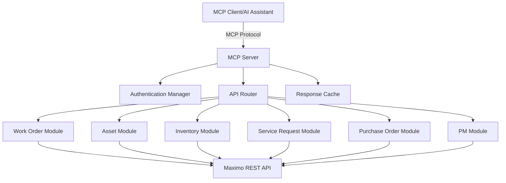
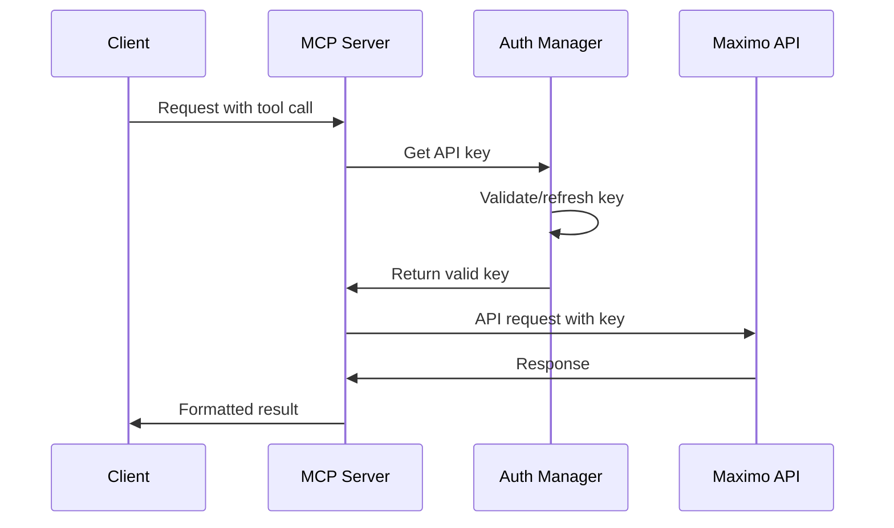

# IBM Maximo MAS 9.x MCP Server Architecture

## Overview

This MCP (Model Context Protocol) server provides comprehensive access to IBM Maximo Application Suite 9.x REST APIs for development, testing, and automation purposes. It enables AI assistants and other MCP clients to interact with Maximo transactions programmatically.

## Architecture Design

### High-Level Architecture



### Component Structure

```
maximo-mcp-server/
├── src/
│   ├── index.ts                 # MCP server entry point
│   ├── config/
│   │   ├── environment.ts       # Environment configuration
│   │   └── maximo-config.ts     # Maximo connection settings
│   ├── auth/
│   │   ├── auth-manager.ts      # Authentication handler
│   │   └── api-key-provider.ts  # API key management
│   ├── core/
│   │   ├── maximo-client.ts     # Base HTTP client
│   │   ├── error-handler.ts     # Error handling utilities
│   │   ├── response-formatter.ts # Response transformation
│   │   └── rate-limiter.ts      # Rate limiting logic
│   ├── modules/
│   │   ├── work-orders/
│   │   │   ├── tools.ts         # Work order MCP tools
│   │   │   ├── operations.ts    # WO business logic
│   │   │   └── types.ts         # WO type definitions
│   │   ├── assets/
│   │   │   ├── tools.ts
│   │   │   ├── operations.ts
│   │   │   └── types.ts
│   │   ├── inventory/
│   │   ├── service-requests/
│   │   ├── purchase-orders/
│   │   ├── locations/
│   │   ├── persons/
│   │   ├── preventive-maintenance/
│   │   ├── classifications/
│   │   └── attachments/
│   ├── tools/
│   │   ├── registry.ts          # Tool registration
│   │   └── validators.ts        # Input validation
│   ├── resources/
│   │   ├── schema-provider.ts   # Maximo object schemas
│   │   └── query-templates.ts   # Saved query templates
│   └── utils/
│       ├── logger.ts            # Logging utilities
│       ├── cache.ts             # Caching layer
│       └── helpers.ts           # Common helpers
├── tests/
├── docs/
├── examples/
├── package.json
└── tsconfig.json
```

## Core Components

### 1. Authentication Manager

Handles API key authentication for Maximo MAS 9.x:

- Secure API key storage and retrieval
- Token refresh mechanisms
- Multi-environment support
- Connection validation

### 2. Maximo Client

Base HTTP client for all API interactions:

- RESTful API communication
- Request/response interceptors
- Automatic retry logic
- Connection pooling
- Timeout management

### 3. Module System

Each Maximo functional area is implemented as a module:

**Work Order Module:**
- Create, read, update, delete work orders
- Change work order status
- Assign work orders to persons/crews
- Add labor, materials, services, tools
- Manage work logs and long descriptions

**Asset Module:**
- Asset CRUD operations
- Record meter readings
- Move assets between locations
- Update asset specifications
- Manage asset hierarchy

**Inventory Module:**
- Item master management
- Storeroom operations
- Inventory transactions (issues, returns, transfers)
- Stock level monitoring
- Reorder processing

**Service Request Module:**
- Service request CRUD
- SR to WO conversion
- Status workflow management
- Related records handling

**Purchase Order Module:**
- PO creation and management
- Receiving operations
- Invoice matching
- Approval workflows

**Preventive Maintenance Module:**
- PM record management
- Job plan operations
- PM schedule generation
- Route management

**Location Module:**
- Location hierarchy navigation
- Location CRUD operations
- System/operating location management

**Person/Labor Module:**
- Person record management
- Labor transaction recording
- Crew management
- Calendar operations

**Classification Module:**
- Classification structure navigation
- Specification template management
- Attribute value management

**Attachment Module:**
- Document upload/download
- Folder operations
- Linked document management

### 4. Query and Search System

Advanced querying capabilities:

- OSLC query support
- Saved query execution
- Advanced search with filters
- Pagination handling
- Result set management

### 5. Bulk Operations

Efficient batch processing:

- Bulk create/update/delete
- Transaction batching
- Progress tracking
- Error recovery

## MCP Tools Design

### Tool Categories

**1. CRUD Operations (per module)**
- `maximo_create_{object}` - Create new records
- `maximo_read_{object}` - Retrieve records
- `maximo_update_{object}` - Update existing records
- `maximo_delete_{object}` - Delete records

**2. Specialized Operations**
- `maximo_change_wo_status` - Change work order status
- `maximo_record_meter_reading` - Record asset meter readings
- `maximo_issue_inventory` - Issue inventory items
- `maximo_receive_po` - Receive purchase order items
- `maximo_generate_pm` - Generate PM work orders

**3. Query Operations**
- `maximo_query` - Execute OSLC queries
- `maximo_search` - Advanced search with filters
- `maximo_get_related` - Retrieve related records

**4. Bulk Operations**
- `maximo_bulk_create` - Bulk record creation
- `maximo_bulk_update` - Bulk record updates
- `maximo_bulk_delete` - Bulk record deletion

**5. Development Tools**
- `maximo_explore_api` - API endpoint exploration
- `maximo_inspect_schema` - Object schema inspection
- `maximo_test_connection` - Connection testing
- `maximo_build_query` - Interactive query builder

## MCP Resources

### Resource Types

**1. Schema Resources**
- Object structure definitions
- Field metadata
- Relationship information
- Domain value lists

**2. Query Templates**
- Pre-built common queries
- Saved query definitions
- Report templates

**3. Configuration Resources**
- Environment settings
- Connection profiles
- API endpoint mappings

## API Integration Strategy

### Maximo REST API Endpoints

**Base URL Structure:**
```
https://{maximo-host}/maximo/api/os/{objectstructure}
```

**Key Object Structures:**
- `mxwodetail` - Work Orders
- `mxasset` - Assets
- `mxinventory` - Inventory
- `mxsr` - Service Requests
- `mxpo` - Purchase Orders
- `mxperson` - Persons
- `mxlocation` - Locations
- `mxpm` - Preventive Maintenance
- `mxclassification` - Classifications

**HTTP Methods:**
- GET - Retrieve records
- POST - Create records
- PATCH - Update records
- DELETE - Delete records

**Query Parameters:**
- `oslc.select` - Field selection
- `oslc.where` - Filtering
- `oslc.orderBy` - Sorting
- `oslc.pageSize` - Pagination
- `lean=1` - Lean mode for performance

### Authentication Flow



### Error Handling Strategy

**Error Categories:**
1. Authentication errors (401, 403)
2. Validation errors (400)
3. Not found errors (404)
4. Server errors (500+)
5. Network errors
6. Rate limiting (429)

**Handling Approach:**
- Automatic retry with exponential backoff
- Detailed error messages with context
- Suggested remediation actions
- Error logging for debugging

## Performance Optimization

### Caching Strategy

**Cache Layers:**
1. Schema cache (long-lived)
2. Domain value cache (medium-lived)
3. Query result cache (short-lived)
4. Connection pool cache

**Cache Invalidation:**
- Time-based expiration
- Event-based invalidation
- Manual cache clearing

### Rate Limiting

- Request throttling per endpoint
- Concurrent request limits
- Backoff strategies
- Queue management

### Connection Pooling

- Persistent HTTP connections
- Connection reuse
- Pool size management
- Health checks

## Security Considerations

### API Key Management

- Secure storage (environment variables)
- Key rotation support
- Access logging
- Encryption at rest

### Data Protection

- No sensitive data in logs
- Secure transmission (HTTPS)
- Input sanitization
- Output validation

### Access Control

- Environment-based restrictions
- Operation-level permissions
- Audit trail logging

## Configuration Management

### Environment Configuration

```typescript
interface MaximoEnvironment {
  name: string;
  host: string;
  apiKey: string;
  timeout: number;
  retryAttempts: number;
  cacheEnabled: boolean;
  logLevel: string;
}
```

### Multi-Environment Support

- Development environment
- Test environment
- Production environment
- Sandbox environment

## Testing Strategy

### Test Types

1. **Unit Tests**
   - Individual tool functions
   - Utility functions
   - Validation logic

2. **Integration Tests**
   - API client operations
   - Module interactions
   - Error handling flows

3. **End-to-End Tests**
   - Complete workflows
   - Multi-step operations
   - Real API interactions

### Test Data Management

- Mock Maximo responses
- Test data fixtures
- Sandbox environment usage

## Deployment

### Installation Methods

1. **NPM Package**
   ```bash
   npm install -g maximo-mcp-server
   ```

2. **Docker Container**
   ```bash
   docker run -p 3000:3000 maximo-mcp-server
   ```

3. **Source Installation**
   ```bash
   git clone repo
   npm install
   npm run build
   ```

### Configuration

**Environment Variables:**
```bash
MAXIMO_HOST=https://your-maximo-host.com
MAXIMO_API_KEY=your-api-key
MAXIMO_TIMEOUT=30000
MAXIMO_CACHE_ENABLED=true
LOG_LEVEL=info
```

**Configuration File:**
```json
{
  "environments": {
    "dev": {
      "host": "https://dev-maximo.com",
      "apiKey": "${DEV_API_KEY}"
    },
    "prod": {
      "host": "https://prod-maximo.com",
      "apiKey": "${PROD_API_KEY}"
    }
  }
}
```

## Documentation Structure

### User Documentation

1. **Getting Started Guide**
   - Installation instructions
   - Basic configuration
   - First API call

2. **Tool Reference**
   - Complete tool catalog
   - Parameter descriptions
   - Usage examples

3. **API Coverage**
   - Supported Maximo objects
   - Available operations
   - Limitations

4. **Cookbook**
   - Common workflows
   - Best practices
   - Troubleshooting

### Developer Documentation

1. **Architecture Guide**
   - System design
   - Component interactions
   - Extension points

2. **API Reference**
   - Internal APIs
   - Module interfaces
   - Utility functions

3. **Contributing Guide**
   - Development setup
   - Coding standards
   - Pull request process

## Future Enhancements

### Phase 2 Features

- GraphQL API support
- WebSocket for real-time updates
- Advanced analytics and reporting
- Custom workflow automation
- Integration with other IBM products

### Phase 3 Features

- AI-powered query optimization
- Predictive maintenance insights
- Natural language query interface
- Mobile device support
- Offline operation mode

## Success Metrics

### Performance Metrics

- API response time < 2 seconds
- Cache hit rate > 70%
- Error rate < 1%
- Uptime > 99.9%

### Usage Metrics

- Number of API calls per day
- Most used tools
- User adoption rate
- Error frequency by tool

## Conclusion

This architecture provides a robust, scalable foundation for building an MCP server that enables comprehensive interaction with IBM Maximo MAS 9.x. The modular design allows for incremental development and easy maintenance, while the focus on developer experience ensures the tool will be valuable for API exploration and automation tasks.