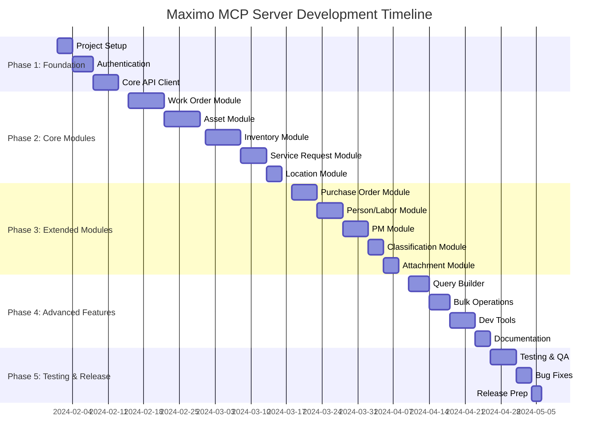

# IBM Maximo MAS 9.x MCP Server - Project Roadmap

## Project Overview

**Project Name:** Maximo MCP Server for API Exploration and Automation

**Purpose:** Build a comprehensive Model Context Protocol (MCP) server that enables AI assistants and developers to explore, test, and automate IBM Maximo Application Suite 9.x transactions through REST APIs.

**Target Users:**
- Maximo developers and administrators
- AI assistants (Claude, ChatGPT, etc.)
- Integration specialists
- QA/Testing teams
- DevOps engineers

**Key Benefits:**
- Simplified Maximo API exploration
- Automated testing capabilities
- Rapid prototyping of integrations
- Reduced learning curve for Maximo APIs
- AI-powered workflow automation

## Project Timeline

### 12-Week Development Plan



## Phase Breakdown

### Phase 1: Foundation (Weeks 1-2)

**Duration:** 2 weeks (Feb 1-14, 2024)

**Objectives:**
- Establish project infrastructure
- Implement core authentication
- Create base API client
- Set up development environment

**Deliverables:**

1. **Project Structure** (Day 1-3)
   - Initialize Node.js/TypeScript project
   - Configure build tools (TypeScript, ESLint, Prettier)
   - Set up testing framework (Jest)
   - Create directory structure
   - Configure Git repository

2. **Authentication System** (Day 4-7)
   - Implement API key authentication
   - Create authentication manager
   - Add token validation
   - Support multiple environments
   - Secure credential storage

3. **Core API Client** (Day 8-12)
   - Build HTTP client wrapper
   - Implement request/response interceptors
   - Add retry logic with exponential backoff
   - Create error handling framework
   - Implement logging system
   - Add connection pooling

**Success Criteria:**
- ✅ Project builds without errors
- ✅ Authentication successfully connects to Maximo
- ✅ API client can make basic GET/POST requests
- ✅ Error handling catches and formats errors properly
- ✅ Unit tests pass with >80% coverage

### Phase 2: Core Modules (Weeks 3-6)

**Duration:** 4 weeks (Feb 15 - Mar 14, 2024)

**Objectives:**
- Implement primary Maximo modules
- Create comprehensive CRUD operations
- Add specialized business operations

**Module Implementation Order:**

#### 1. Work Order Module (Week 3)
**Tools to Implement:**
- `maximo_create_workorder`
- `maximo_get_workorder`
- `maximo_update_workorder`
- `maximo_delete_workorder`
- `maximo_change_workorder_status`
- `maximo_add_labor`
- `maximo_add_material`
- `maximo_add_service`
- `maximo_add_worklog`
- `maximo_assign_workorder`
- `maximo_search_workorders`

**Key Features:**
- Status workflow management
- Labor/material/service transactions
- Work log management
- Assignment capabilities

#### 2. Asset Module (Week 4)
**Tools to Implement:**
- `maximo_create_asset`
- `maximo_get_asset`
- `maximo_update_asset`
- `maximo_delete_asset`
- `maximo_move_asset`
- `maximo_record_meter`
- `maximo_get_asset_hierarchy`
- `maximo_update_asset_spec`
- `maximo_search_assets`

**Key Features:**
- Asset hierarchy navigation
- Meter reading management
- Location tracking
- Specification management

#### 3. Inventory Module (Week 5)
**Tools to Implement:**
- `maximo_create_item`
- `maximo_get_inventory`
- `maximo_issue_inventory`
- `maximo_return_inventory`
- `maximo_transfer_inventory`
- `maximo_adjust_inventory`
- `maximo_get_inventory_transactions`
- `maximo_search_items`

**Key Features:**
- Inventory transactions
- Stock level management
- Multi-storeroom support
- Transaction history

#### 4. Service Request Module (Week 6, Days 1-5)
**Tools to Implement:**
- `maximo_create_sr`
- `maximo_get_sr`
- `maximo_update_sr`
- `maximo_delete_sr`
- `maximo_change_sr_status`
- `maximo_convert_sr_to_wo`
- `maximo_search_srs`

**Key Features:**
- SR lifecycle management
- Workflow operations
- WO conversion

#### 5. Location Module (Week 6, Days 6-7)
**Tools to Implement:**
- `maximo_create_location`
- `maximo_get_location`
- `maximo_update_location`
- `maximo_delete_location`
- `maximo_get_location_hierarchy`
- `maximo_search_locations`

**Key Features:**
- Location hierarchy
- Operating/system locations
- Parent-child relationships

**Success Criteria:**
- ✅ All core modules fully functional
- ✅ CRUD operations work correctly
- ✅ Specialized operations tested
- ✅ Integration tests pass
- ✅ Documentation complete for each module

### Phase 3: Extended Modules (Weeks 7-9)

**Duration:** 3 weeks (Mar 15 - Apr 4, 2024)

**Objectives:**
- Complete remaining Maximo modules
- Add advanced functionality
- Implement bulk operations

#### 1. Purchase Order Module (Week 7)
**Tools to Implement:**
- `maximo_create_po`
- `maximo_get_po`
- `maximo_update_po`
- `maximo_delete_po`
- `maximo_receive_po`
- `maximo_approve_po`
- `maximo_search_pos`

#### 2. Person/Labor Module (Week 8)
**Tools to Implement:**
- `maximo_create_person`
- `maximo_get_person`
- `maximo_update_person`
- `maximo_record_labor`
- `maximo_get_labor_transactions`
- `maximo_search_persons`

#### 3. Preventive Maintenance Module (Week 9, Days 1-5)
**Tools to Implement:**
- `maximo_create_pm`
- `maximo_get_pm`
- `maximo_update_pm`
- `maximo_delete_pm`
- `maximo_generate_pm_wo`
- `maximo_create_jobplan`
- `maximo_search_pms`

#### 4. Classification Module (Week 9, Days 6-7)
**Tools to Implement:**
- `maximo_get_classification`
- `maximo_get_class_hierarchy`
- `maximo_get_class_spec`
- `maximo_update_spec_values`

#### 5. Attachment Module (Week 9, Days 8-9)
**Tools to Implement:**
- `maximo_upload_attachment`
- `maximo_download_attachment`
- `maximo_list_attachments`
- `maximo_delete_attachment`

**Success Criteria:**
- ✅ All extended modules operational
- ✅ Bulk operations support added
- ✅ File upload/download working
- ✅ Integration tests complete

### Phase 4: Advanced Features (Weeks 10-11)

**Duration:** 2 weeks (Apr 5-18, 2024)

**Objectives:**
- Add development and testing tools
- Implement performance optimizations
- Create comprehensive documentation

#### 1. Query and Search System (Week 10, Days 1-4)
**Tools to Implement:**
- `maximo_query` - OSLC query execution
- `maximo_advanced_search` - Multi-filter search
- `maximo_saved_query` - Saved query execution
- `maximo_build_query` - Interactive query builder

**Features:**
- OSLC query language support
- Complex filter combinations
- Pagination handling
- Result formatting

#### 2. Bulk Operations (Week 10, Days 5-7)
**Tools to Implement:**
- `maximo_bulk_create`
- `maximo_bulk_update`
- `maximo_bulk_delete`
- `maximo_batch_process`

**Features:**
- Transaction batching
- Error recovery
- Progress tracking
- Rollback support

#### 3. Development Tools (Week 11, Days 1-5)
**Tools to Implement:**
- `maximo_test_connection` - Connection testing
- `maximo_explore_api` - API endpoint explorer
- `maximo_inspect_schema` - Schema inspector
- `maximo_validate_data` - Data validator
- `maximo_get_domain_values` - Domain value lookup
- `maximo_get_relationships` - Relationship explorer

**Features:**
- API discovery
- Schema introspection
- Data validation
- Interactive exploration

#### 4. Performance Optimization (Week 11, Days 6-7)
**Implementations:**
- Response caching layer
- Connection pooling
- Rate limiting
- Request queuing
- Lazy loading

#### 5. Documentation (Week 11, Days 8-10)
**Documents to Create:**
- Getting Started Guide
- Tool Catalog (complete reference)
- API Coverage Matrix
- Cookbook (common workflows)
- Troubleshooting Guide
- FAQ

**Success Criteria:**
- ✅ Query builder functional
- ✅ Bulk operations tested
- ✅ Dev tools working
- ✅ Performance benchmarks met
- ✅ Documentation complete

### Phase 5: Testing and Release (Week 12)

**Duration:** 1 week (Apr 19-25, 2024)

**Objectives:**
- Comprehensive testing
- Bug fixes and refinement
- Release preparation

#### 1. Testing (Days 1-5)
**Test Types:**
- Unit tests (>80% coverage)
- Integration tests (all modules)
- End-to-end tests (workflows)
- Performance tests (load testing)
- Security audit

**Test Scenarios:**
- Happy path workflows
- Error handling
- Edge cases
- Concurrent operations
- Large data sets

#### 2. Bug Fixes (Days 6-8)
- Address test failures
- Fix performance issues
- Resolve security concerns
- Update documentation

#### 3. Release Preparation (Days 9-10)
- Version tagging
- Release notes
- Deployment scripts
- Installation guide
- Migration guide

**Success Criteria:**
- ✅ All tests passing
- ✅ No critical bugs
- ✅ Performance targets met
- ✅ Security audit passed
- ✅ Documentation reviewed
- ✅ Release artifacts ready

## MCP Tools Summary

### Total Tools: 80+

**By Category:**

1. **Work Orders** (11 tools)
   - CRUD operations
   - Status management
   - Labor/material/service
   - Work logs
   - Assignments

2. **Assets** (9 tools)
   - CRUD operations
   - Meter readings
   - Asset moves
   - Hierarchy navigation
   - Specifications

3. **Inventory** (8 tools)
   - Item management
   - Transactions (issue/return/transfer)
   - Balance adjustments
   - Transaction history

4. **Service Requests** (7 tools)
   - CRUD operations
   - Status management
   - WO conversion

5. **Purchase Orders** (7 tools)
   - CRUD operations
   - Receiving
   - Approvals

6. **Locations** (6 tools)
   - CRUD operations
   - Hierarchy navigation

7. **Persons/Labor** (6 tools)
   - Person management
   - Labor transactions

8. **Preventive Maintenance** (7 tools)
   - PM management
   - Job plans
   - WO generation

9. **Classifications** (4 tools)
   - Classification navigation
   - Specification management

10. **Attachments** (4 tools)
    - Upload/download
    - Document management

11. **Query & Search** (4 tools)
    - OSLC queries
    - Advanced search
    - Query builder

12. **Bulk Operations** (4 tools)
    - Bulk create/update/delete
    - Batch processing

13. **Development Tools** (6 tools)
    - Connection testing
    - API exploration
    - Schema inspection
    - Data validation

## Technical Stack

### Core Technologies
- **Runtime:** Node.js 18+
- **Language:** TypeScript 5+
- **MCP SDK:** @modelcontextprotocol/sdk
- **HTTP Client:** axios
- **Validation:** zod
- **Logging:** winston
- **Caching:** node-cache

### Development Tools
- **Build:** TypeScript compiler, esbuild
- **Testing:** Jest, Supertest
- **Linting:** ESLint
- **Formatting:** Prettier
- **Mocking:** MSW (Mock Service Worker)

### Infrastructure
- **Version Control:** Git
- **CI/CD:** GitHub Actions
- **Package Manager:** npm
- **Documentation:** Markdown, JSDoc

## Success Metrics

### Performance Targets
- API response time: < 2 seconds (95th percentile)
- Cache hit rate: > 70%
- Error rate: < 1%
- Uptime: > 99.9%
- Concurrent requests: 100+

### Quality Targets
- Test coverage: > 80%
- Documentation coverage: > 90%
- Code quality: A grade (SonarQube)
- Security: No critical vulnerabilities

### Adoption Metrics
- GitHub stars: 100+ (6 months)
- npm downloads: 1000+ (6 months)
- Active users: 50+ (6 months)
- Community contributions: 10+ PRs

## Risk Management

### Technical Risks

| Risk | Impact | Probability | Mitigation |
|------|--------|-------------|------------|
| Maximo API changes | High | Medium | Version checking, graceful degradation |
| Performance issues | Medium | Medium | Caching, connection pooling, optimization |
| Authentication failures | High | Low | Retry logic, clear error messages |
| Rate limiting | Medium | High | Built-in rate limiter, queue management |
| Network failures | Medium | Medium | Retry logic, timeout handling |

### Project Risks

| Risk | Impact | Probability | Mitigation |
|------|--------|-------------|------------|
| Scope creep | Medium | Medium | Clear requirements, phased approach |
| Timeline delays | Medium | Low | Buffer time, prioritization |
| Resource constraints | Low | Low | Modular design, incremental delivery |
| Documentation gaps | Medium | Medium | Continuous documentation, reviews |

## Dependencies

### External Dependencies
- IBM Maximo MAS 9.x instance (for testing)
- API key with appropriate permissions
- Network access to Maximo server
- Node.js development environment

### Internal Dependencies
- MCP SDK availability
- TypeScript compiler
- Testing frameworks
- Documentation tools

## Deployment Strategy

### Distribution Methods

1. **NPM Package**
   ```bash
   npm install -g maximo-mcp-server
   maximo-mcp-server --config config.json
   ```

2. **Docker Container**
   ```bash
   docker pull maximo-mcp-server:latest
   docker run -p 3000:3000 -e MAXIMO_HOST=... maximo-mcp-server
   ```

3. **Source Installation**
   ```bash
   git clone https://github.com/org/maximo-mcp-server
   cd maximo-mcp-server
   npm install
   npm run build
   npm start
   ```

### Configuration

**Environment Variables:**
```bash
MAXIMO_HOST=https://your-maximo-host.com
MAXIMO_API_KEY=your-api-key
MAXIMO_TIMEOUT=30000
LOG_LEVEL=info
CACHE_ENABLED=true
```

**Configuration File:**
```json
{
  "environments": {
    "dev": {
      "host": "https://dev-maximo.com",
      "apiKey": "${DEV_API_KEY}"
    },
    "prod": {
      "host": "https://prod-maximo.com",
      "apiKey": "${PROD_API_KEY}"
    }
  }
}
```

## Future Enhancements

### Phase 2 Features (Q3 2024)
- GraphQL API support
- WebSocket for real-time updates
- Advanced analytics and reporting
- Custom workflow automation
- Integration with IBM Maximo Manage

### Phase 3 Features (Q4 2024)
- AI-powered query optimization
- Predictive maintenance insights
- Natural language query interface
- Mobile device support
- Offline operation mode

### Phase 4 Features (2025)
- Multi-tenant support
- Advanced security features
- Performance monitoring dashboard
- Custom plugin system
- Enterprise features

## Community and Support

### Open Source Strategy
- MIT License
- GitHub repository
- Issue tracking
- Pull request process
- Code of conduct

### Documentation
- GitHub Wiki
- API documentation site
- Video tutorials
- Blog posts
- Conference talks

### Support Channels
- GitHub Issues
- Stack Overflow tag
- Discord/Slack community
- Email support
- Professional services

## Conclusion

This roadmap provides a clear path to building a comprehensive MCP server for IBM Maximo MAS 9.x. The phased approach ensures steady progress while maintaining quality and allowing for feedback incorporation.

**Key Success Factors:**
1. Clear architecture and design
2. Comprehensive API coverage
3. Robust error handling
4. Excellent documentation
5. Strong testing strategy
6. Active community engagement

**Next Steps:**
1. Review and approve this plan
2. Set up development environment
3. Begin Phase 1 implementation
4. Establish regular progress reviews
5. Engage with early adopters

The project is positioned to become the standard tool for Maximo API exploration and automation, significantly improving developer productivity and reducing the learning curve for Maximo integrations.